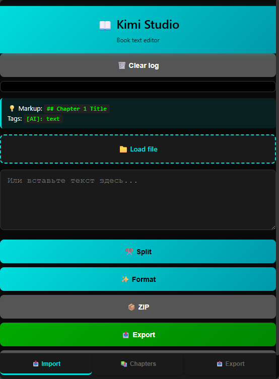

# Kimi Book Studio

Конвертируйте ваши диалоги с Perchance AI Character Chat в правильно отформатированные книги (EPUB/TXT/HTML).

## 🚀 Быстрый старт

### Попробовать онлайн (без скачивания):

**Perchance версия (рекомендуется):**
- [Kimi Book Studio на Perchance](https://perchance.org/wmf11xla4b)

**GitHub Pages версии:**
- [English version →](https://roflsockie.github.io/Kimi-Studio/Kimi-Studio-EN.html)
- [Russian version →](https://roflsockie.github.io/Kimi-Studio/Kimi-Studio-RU.html)

### Скачать для оффлайн использования:

- [Kimi-Studio-EN.html](https://raw.githubusercontent.com/Roflsockie/Kimi-Studio/main/Kimi-Studio-EN.html) - Правый клик → Сохранить как
- [Kimi-Studio-RU.html](https://raw.githubusercontent.com/Roflsockie/Kimi-Studio/main/Kimi-Studio-RU.html) - Правый клик → Сохранить как

## ✨ Особенности

- Единый HTML файл - работает оффлайн, установка не требуется
- Экспорт в EPUB, TXT, HTML
- Поддержка длинных диалогов
- Мобильный интерфейс
- Полностью бесплатно и без рекламы

## 📸 Скриншоты

## 🎯 Как использовать

1. Откройте приложение в браузере
2. Вставьте ваш JSON из Perchance AI Chat
3. Настройте параметры (название книги, имена персонажей)
4. Нажмите кнопку экспорта
5. Скачайте вашу книгу в нужном формате

## 💝 Поддержать проект

Если вам нравится этот проект и вы хотите поддержать его развитие:

- ☕ [Buy Me a Coffee](https://www.buymeacoffee.com/roflsockie)
- 💳 [Donationalerts](https://www.donationalerts.com/r/roflsockie)

Ваша поддержка помогает мне продолжать разработку и добавлять новые функции!

## 📝 Лицензия

МIT License - используйте свободно!

## 🔗 Ссылки

- [Perchance AI Chat](https://perchance.org/ai-character-chat)
- [Сообщить об ошибке](https://github.com/Roflsockie/Kimi-Studio/issues)
